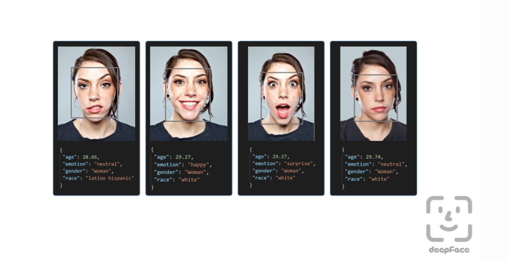
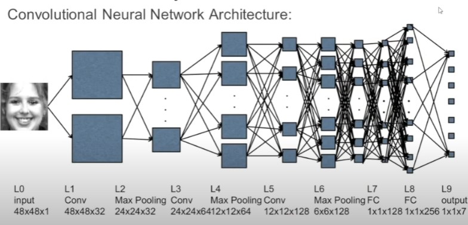

# Live Class Monitoring System(Face Emotion Recognition)

## Introduction

Emotion recognition is the process of identifying human emotion. People vary widely in their accuracy at recognizing the emotions of others. Use of technology to help people with emotion recognition is a relatively nascent research area. Generally, the technology works best if it uses multiple modalities in context. To date, the most work has been conducted on automating the recognition of facial expressions from video, spoken expressions from audio, written expressions from text, and physiology as measured by wearables.

Facial expressions are a form of nonverbal communication. Various studies have been done for the classification of these facial expressions. There is strong evidence for the universal facial expressions of seven emotions which include: neutral happy, sadness, anger, disgust, fear, and surprise. So it is very important to detect these emotions on the face as it has wide applications in the field of Computer Vision and Artificial Intelligence. These fields are researching on the facial emotions to get the sentiments of the humans automatically.

## Problem Statement

The Indian education landscape has been undergoing rapid changes for the past 10 years owing to the advancement of web-based learning services, specifically, eLearning platforms.

Global E-learning is estimated to witness an 8X over the next 5 years to reach USD 2B in 2021. India is expected to grow with a CAGR of 44% crossing the 10M users mark in 2021. Although the market is growing on a rapid scale, there are major challenges associated with digital learning when compared with brick and mortar classrooms.
One of many challenges is how to ensure quality learning for students. Digital platforms might overpower physical classrooms in terms of content quality but when it comes to understanding whether students are able to grasp the content in a live class scenario is yet an open-end challenge.
In a physical classroom during a lecturing teacher can see the faces and assess the emotion of the class and tune their lecture accordingly, whether he is going fast or slow. He can identify students who need special attention.

Digital classrooms are conducted via video telephony software program (ex-Zoom) where it’s not possible for medium scale class (25-50) to see all students and access the mood. Because of this drawback, students are not focusing on content due to lack of surveillance.

While digital platforms have limitations in terms of physical surveillance but it comes with the power of data and machines which can work for you. It provides data in the form of video, audio, and texts which can be analyzed using deep learning algorithms.

Deep learning backed system not only solves the surveillance issue, but it also removes the human bias from the system, and all information is no longer in the teacher’s brain rather translated in numbers that can be analyzed and tracked.

I will solve the above-mentioned challenge by applying deep learning algorithms to live video data.
The solution to this problem is by recognizing facial emotions.

## Dataset Information

I have built a deep learning model which detects the real time emotions of students through a webcam so that teachers can understand if students are able to grasp the topic according to students' expressions or emotions and then deploy the model. The model is trained on the FER-2013 dataset .This dataset consists of 35887 grayscale, 48x48 sized face images with seven emotions - angry, disgusted, fearful, happy, neutral, sad and surprised.
Here is the dataset link:-  https://www.kaggle.com/msambare/fer2013

## Dependencies

1)	Python 3
2)	Tensorflow 2.0
3)	Streamlit
4)	Streamlit-Webrtc
5)	OpenCV

## Model Creation

### 1)	Using DeepFace

DeepFace is a deep learning facial recognition system created by a research group at Facebook. It identifies human faces in digital images. The program employs a nine-layer neural network with over 120 million connection weights and was trained on four million images uploaded by Facebook users.The Facebook Research team has stated that the DeepFace method reaches an accuracy of 97.35% ± 0.25% on Labeled Faces in the Wild (LFW) data set where human beings have 97.53%. This means that DeepFace is sometimes more successful than the human beings.

 
•	The actual emotion in the Picture was ANGRY Face but using DeepFace I found the prediction is HAPPY.

### 2)	Using Transfer Learning

Transfer learning (TL) is a research problem in machine learning (ML) that focuses on storing knowledge gained while solving one problem and applying it to a different but related problem. For example, knowledge gained while learning to recognize cars could apply when trying to recognize trucks. This area of research bears some relation to the long history of psychological literature on transfer of learning, although formal ties between the two fields are limited. From the practical standpoint, reusing or transferring information from previously learned tasks for the learning of new tasks has the potential to significantly improve the sample efficiency of a reinforcement learning agent.

 
•	I have trained the model with MobileNetV2 and got the accuracy of 94% ,But while testing i got the model was overfitted. I tried to see the prediction of an image and found that the prediction was wrong. 

### 3)	Using  Deep Learning CNN

In deep learning, a convolutional neural network (CNN, or ConvNet) is a class of deep neural network, most commonly applied to analyze visual imagery. They are also known as shift invariant or space invariant artificial neural networks (SIANN), based on the shared-weight architecture of the convolution kernels or filters that slide along input features and provide translation equivariant responses known as feature maps.Counter-intuitively, most convolutional neural networks are only equivariant, as opposed to invariant, to translation. They have applications in image and video recognition, recommender systems, image classification, image segmentation, medical image analysis, natural language processing, brain-computer interfaces, and financial time series.CNNs are regularized versions of multilayer perceptrons. Multilayer perceptrons usually mean fully connected networks, that is, each neuron in one layer is connected to all neurons in the next layer. The "full connectivity" of these networks make them prone to overfitting data. Typical ways of regularization, or preventing overfitting, include: penalizing parameters during training (such as weight decay) or trimming connectivity (skipped connections, dropout, etc.) CNNs take a different approach towards regularization: they take advantage of the hierarchical pattern in data and assemble patterns of increasing complexity using smaller and simpler patterns embossed in their filters. Therefore, on a scale of connectivity and complexity, CNNs are on the lower extreme. Convolutional networks were inspired by biological processes in that the connectivity pattern between neurons resembles the organization of the animal visual cortex. Individual cortical neurons respond to stimuli only in a restricted region of the visual field known as the receptive field. The receptive fields of different neurons partially overlap such that they cover the entire visual field.CNNs use relatively little pre-processing compared to other image classification algorithms. This means that the network learns to optimize the filters (or kernels) through automated learning, whereas in traditional algorithms these filters are hand-engineered. This independence from prior knowledge and human intervention in feature extraction is a major advantage.

 

•	The training gave the accuracy of 82% and test accuracy of 66%. It seems excellent. So, I save the model and the detection i got from live video was excellent.
•	One drawback of the system is the some Disgust faces are showing Neutral .Because less no. of disgust faces are given to train .This may be the reason.
•	I thought it was a good score should improve the score.
•	Thus I decided that I will deploy the model.

## Loss & Accuracy Plot

 

To See the  Training and Testing python file follow this link: https://github.com/soumya1999rta/Face-Emotion-Recognition/blob/main/Soumya_Ranjan_Mishra_Live_Class_Monitoring_System_(Face_Emotion_Recognition)_Capstone_Project%20(1).ipynb

## Realtime Local Video Face Detection

I created two patterns for detecting and predicting single faces and as well as multiple faces using OpenCV videocapture in local.
For Webapp , OpenCV can’t be used. Thus, using Streamlit-Webrtc for front-end application.

## Deployment of Streamlit WebApp in Heroku and Streamlit

In this repository I have made a front end using streamlit .Streamlit doesn’t provide the live capture feature itself, instead uses a third party API. I have used streamlit-webrtc which helped to deal with real-time video streams. Image captured from the webcam is sent to VideoTransformer function to detect the emotion. Then this model was deployed on heroku and streamlit platform with the help of buildpack-apt which is necessary to deploy opencv model on heroku and streamlit.

Heroku Link:- https://face-emotion-recognition-somya.herokuapp.com

Streamlit Link:- https://share.streamlit.io/soumya1999rta/face-emotion-recognition/main/app.py

[ N.B:- If the website didn’t open , then try refreshing the page 2 to 3 times.]

## Conclusion

Finally I build the webapp and deployed which has training accuracy of 82% and test accuracy of 66% .

If failed to access the website and just wanted to see how the webapp works, then visit this link:-  https://github.com/soumya1999rta/Face-Emotion-Recognition/blob/main/Face_Emotion_Recognition_Local_Demo_Video.mp4

## Some Real Life Learning from thing amazing project

•	Never Give Up.

•	Update yourself from your Failures.

•	A Scientist needs to overcome the failures.

•	Try existing all methods to reach the goal.

•	Have Patience and Good things take time to happen.

